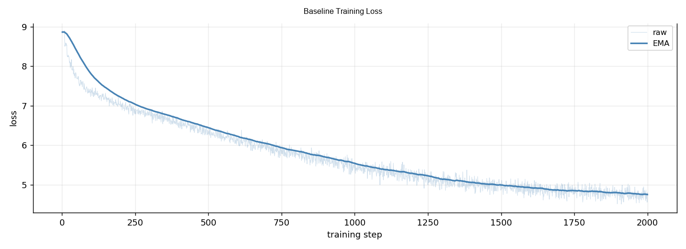
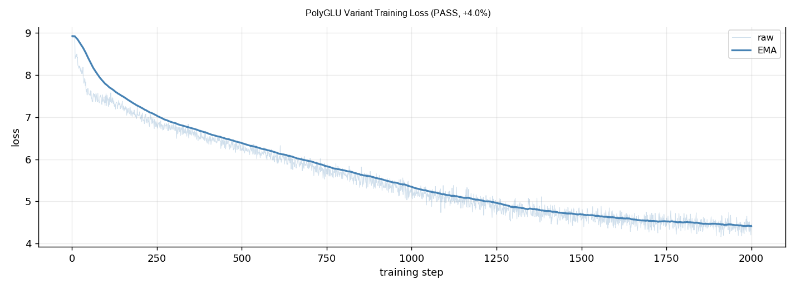

# LLM Paper Agent + MiniMind

An end-to-end agent pipeline that reads recent arXiv papers, uses Claude to generate targeted code patches for [MiniMind](https://github.com/jingyaogong/minimind), trains the patched model, and measures perplexity improvement.

---

## Pipeline Overview

```
Task 1 — Literature Review
  arXiv search (4 goals)
       ↓
  Load memory context (past experiment calibration per technique category)
       ↓
  Claude scores papers (novelty × practicality × applicability × memory-calibrated confidence)
       ↓
  Ranked report saved to results/reports/

Task 2 — Agent Experiment Loop
  Read top-ranked papers
       ↓
  Load memory context (technique registry + failure analyses + synthesis)
       ↓
  Claude reads paper + model source + memory → outputs { old_code, new_code } patch
       ↓
  Validate (exact match + ast.parse) → apply to model_minimind.py
       ↓
  Train MiniMind variant (~64MB, 1 epoch, RTX 5070)
       ↓
  Evaluate perplexity → compare to frozen baseline
       ↓
  PASS if relative improvement > 2%  |  always revert patch
       ↓
  FAIL → Claude post-mortem (what_failed / root_cause / avoid_pattern) → memory
       ↓
  Regenerate memory summary → ready for next experiment
```

---

## Architecture

### Task 1 — Literature Review

- **`task1_literature_review/fetcher.py`** — Queries arXiv across 4 improvement goals (architecture, training efficiency, data quality, training objective), deduplicates and returns up to 32 papers.
- **`task1_literature_review/scorer.py`** — Injects past experiment history (`build_context_for_scoring()`) into each scoring prompt so Claude calibrates confidence based on which technique categories have succeeded or failed; scores novelty / practicality / clarity and returns a confidence score (0–1).
- **`task1_literature_review/report.py`** — Saves ranked results as Markdown + JSON.

### Task 2 — Agent Loop

- **`task2_experiment/agent_loop.py`** — Core loop. For each paper above the confidence threshold:
  1. Calls `claude_generate_patch()`: prepends memory context (`build_context_for_patch()` — technique-level pass rates, recent failure lessons, synthesis) to the prompt, then sends paper abstract + model source to Claude, receives `{ old_code, new_code, change_description, reason, can_implement }`.
  2. Validates the patch: `old_code` must be a verbatim substring of `model_minimind.py`, and the patched file must parse as valid Python (`ast.parse`).
  3. Applies patch via `str.replace`, trains variant, compares PPL to baseline; always reverts model file after each experiment.
  4. On FAIL: calls `claude_analyze_failure()` for structured post-mortem (`what_failed`, `root_cause`, `avoid_pattern`, `transferable_lesson`), stores result in memory.
  5. After all experiments: calls `claude_generate_memory_summary()` to synthesize findings into a strategic summary for the next run.

- **`task2_experiment/evaluator.py`** — Trains MiniMind from scratch with cosine-decay LR schedule; caches baseline PPL in `results/baseline.json`.
- **`task2_experiment/tracker.py`** — Saves per-experiment JSON records and generates a Markdown summary report.
- **`task2_experiment/memory.py`** — Active memory system with three layers:
  - `technique_registry` — per-category pass/fail statistics updated after every experiment
  - `failure_analyses` — structured post-mortem entries from `claude_analyze_failure()`
  - `memory_summary` — Claude-generated strategic synthesis regenerated each run
  - `build_context_for_patch()` / `build_context_for_scoring()` — format memory into prompt-ready context blocks

### Model — MiniMind

| Parameter | Value |
|-----------|-------|
| Architecture | Decoder-only transformer |
| Hidden size | 768 |
| Layers | 8 |
| Parameters | ~64MB |
| Positional encoding | RoPE (θ = 1e6) |
| Normalization | RMSNorm (ε = 1e-6) |
| Feed-forward | SwiGLU |
| Attention | Grouped Query Attention (8 heads, 4 KV heads) |

### Training Config

| Parameter | Value |
|-----------|-------|
| Batch size | 32 (effective 256 with grad accum × 8) |
| Learning rate | 5e-4 (cosine decay) |
| Sequence length | 340 |
| dtype | bfloat16 |
| GPU | RTX 5070 8GB |
| Epoch time | ~80 min |

---

## Results

4 experiments run. 1 PASS (>2% relative PPL improvement).

| Paper | Change | Baseline PPL | Variant PPL | Rel. Improvement | Result |
|-------|--------|-------------|-------------|-----------------|--------|
| [PolyGLU: State-Conditional Activation Routing](https://arxiv.org/abs/2603.13347) | Replace SwiGLU with PolyGLU (Gumbel-Softmax routing over 4 activations) | 124.91 | 119.90 | **+4.0%** | ✅ PASS |
| [Orthogonal Quadratic Complements for ViT FFN](https://arxiv.org/abs/2604.09709) | OQC-LR low-rank quadratic complement in FeedForward | 124.91 | 132.65 | -6.2% | ❌ FAIL |
| [Compute Aligned Training](https://arxiv.org/abs/2604.24957) | Modified training objective | 124.91 | 137.23 | -9.9% | ❌ FAIL |
| [Graph Memory Transformer](https://arxiv.org/abs/2604.23862) | Graph-based memory attention | 124.91 | 152.52 | -22.1% | ❌ FAIL |

### PolyGLU (PASS)

PolyGLU replaces MiniMind's fixed SwiGLU gate with a learnable mixture of 4 activation functions (SiLU, GELU, ReLU, Tanh), using Gumbel-Softmax routing during training:

```python
# Before (SwiGLU)
def forward(self, x):
    return self.down_proj(self.act_fn(self.gate_proj(x)) * self.up_proj(x))

# After (PolyGLU)
def forward(self, x):
    gate = self.gate_proj(x)
    route_logits = self._polyglu_static + self._polyglu_router(x)
    weights = F.softmax((route_logits + gumbel_noise), dim=-1)  # during training
    acts = self._polyglu_activations(gate)  # [SiLU, GELU, ReLU, Tanh]
    mixed_act = (acts * weights.unsqueeze(-2)).sum(dim=-1)
    return self.down_proj(mixed_act * self.up_proj(x))
```

> "PolyGLU's mixture of activation functions allows the network to adaptively select the most appropriate non-linearity for different input contexts, rather than being constrained to SwiGLU's fixed inductive bias."

### Loss Curves

**Baseline**



**PolyGLU variant (PASS)**



---

## Usage

```bash
# Install dependencies
pip install -r requirements.txt

# Set API key
echo "ANTHROPIC_API_KEY=your_key_here" > .env

# Download MiniMind dataset (not included — ~1.2GB)
# Place pretrain_t2t_mini.jsonl at minimind/dataset/pretrain_t2t_mini.jsonl

# Task 1: fetch and score papers
python main.py task1

# Task 2: run agent experiment loop (real training, ~80 min/experiment)
python main.py task2

# Task 2 with mock evaluator (no training, for testing)
python main.py task2 --mock

# View experiment summary
python main.py summary
```

---

## File Structure

```
├── config.py                      # Global constants (paths, model, training params)
├── main.py                        # CLI entry point
├── requirements.txt
├── task1_literature_review/
│   ├── fetcher.py                 # arXiv search across 4 improvement goals
│   ├── scorer.py                  # Claude scoring with memory-calibrated confidence
│   ├── report.py                  # Markdown report generation
│   └── agent.py                   # Orchestrates task1
├── task2_experiment/
│   ├── agent_loop.py              # Core loop: memory injection → patch → train → post-mortem
│   ├── evaluator.py               # MiniMind training + PPL evaluation
│   ├── tracker.py                 # Experiment JSON records + reports
│   └── memory.py                  # Active memory: technique_registry, failure_analyses,
│                                  # memory_summary, build_context_for_patch/scoring
├── minimind/                      # MiniMind source (third-party, read-only)
│   ├── model/model_minimind.py    # Patched by the agent during experiments
│   └── model/tokenizer.json
└── results/
    ├── baseline.json              # Cached baseline PPL
    ├── agent_memory.json          # Active memory store (technique registry + analyses)
    ├── reports/                   # Task 1 paper reports
    ├── experiments/               # Per-experiment JSON records
    └── plots/                     # Training loss curves (PNG)
```

---

## Notes

- Model weights (`results/models/`) and training data (`minimind/dataset/*.jsonl`) are excluded from the repo due to size.
- The agent always reverts `model_minimind.py` after each experiment, so the source file in this repo is the unmodified baseline.
- Baseline PPL is cached; delete `results/baseline.json` to force re-training.
